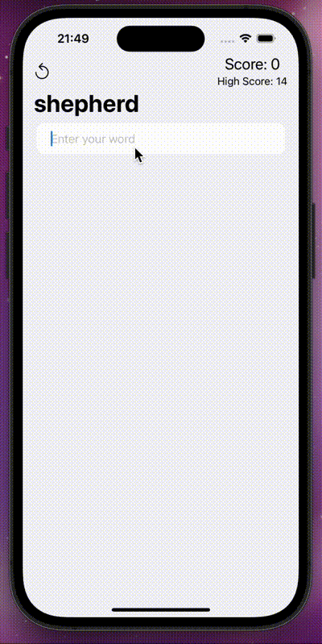

<h1 align="center">Word Scramble</h1>

WordScramble is a fun word game. Players get a random word and make as many words as they can from it. For example, if the word is "alarming", they might spell "alarm", "ring", "main", and more. With over 12,000 words, it's a great way to improve your vocabulary.

  

<h2>Usage</h2>

The basic usage of the app is as follows:

<ol>
  <li>When the app starts, a random word is displayed in scrambled form.</li>
  <li>Enter your guess in the TextField and press Enter.</li>
  <li>Earn points by finding correct words.</li>
  <li>Watch the confetti animation when you surpass your high score.</li>
</ol>

<h2>Installation</h2>

To clone and run this project locally, follow these steps:

<ol>
  <li>Clone the repository:
    <pre><code>git clone https://github.com/username/wordscramble.git</code></pre>
  </li>
  <li>Navigate to the project directory:
    <pre><code>cd wordscramble</code></pre>
  </li>
  <li>Open Xcode and launch the project:
    <pre><code>open WordScramble.xcodeproj</code></pre>
  </li>
</ol>
